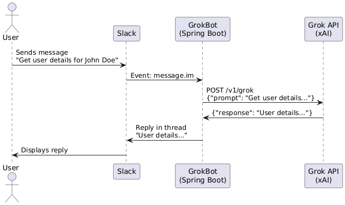

# Slack GrokBot

## Overview
Slack GrokBot is a Kotlin-based Spring Boot application that integrates with the Slack AI Apps API to provide a conversational bot in Slack channels. The bot processes user messages, queries the xAI Grok API for user details, and responds in-thread. Future enhancements will include integration with the SeaLights API for retrieving code coverage and TGA reports.
## Features

- Listens for Slack events (assistant_thread_started, message.im) using the Slack Bolt framework.
- Queries the xAI Grok API to fetch user details based on user input.
- Built with Kotlin, Spring Boot, and Gradle Kotlin DSL for robust development.
Planned: SeaLights API integration for coverage dashboard queries.

## Architecture
See [SL Coverge Bot Architecture](docs/ARCHITECTURE.md) for details on the tech stack, APIs, and application architecture, including a PlantUML diagram.

## Prerequisites

JDK: 17 or higher
Gradle: 8.x (or use ./gradlew)
Docker: For building and running the Docker image
Slack Workspace: Admin access for app creation
xAI Grok API Key: Obtain from xAI Docs
Slack Tokens: Bot User OAuth Token (xoxb-) and App Token (xapp-)

## Setup

Clone the repository:git clone <repository-url>
cd slack-grok-bot

Configure environment variables:
Create .env in the project root:SLACK_BOT_TOKEN=xoxb-<your-bot-token>
SLACK_APP_TOKEN=xapp-<your-app-token>
GROK_API_KEY=<your-grok-api-key>

Configure Slack app:
Create an app at Slack API with AI Apps features enabled.
Subscribe to events: assistant_thread_started, assistant_thread_context_changed, message.im.
Install the app to your workspace to obtain tokens.

Build
Build the project using Gradle:
./gradlew build

This compiles the Kotlin code, runs ktlint checks (if configured), and generates a JAR in build/libs.
Test
Run unit and integration tests with JUnit 5 and MockK:
./gradlew test

Build and Run Docker Image

Build the Docker image:./gradlew bootJar
docker build -t slack-grok-bot:latest .

Run the Docker container:docker run -p 8080:8080 --env-file .env slack-grok-bot:latest

The app runs on port 8080.
Ensure .env contains valid SLACK_BOT_TOKEN, SLACK_APP_TOKEN, and GROK_API_KEY.

[Contribution
guidelines for this project](docs/CONTRIBUTING.md)